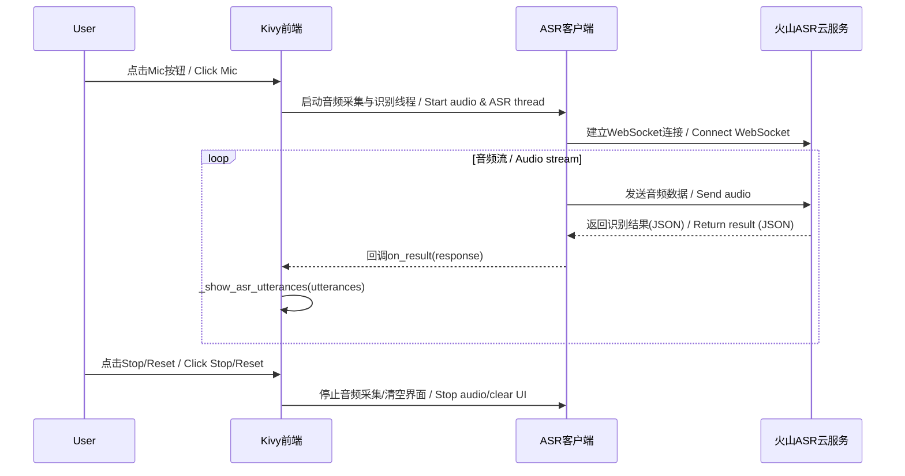

# Translate Chat 主界面说明 / Main Window Guide

---

## 界面布局 / Layout Overview

- **窗口标题**：Translate Chat
- **整体分为四部分**：
  1. 顶部标题区
  2. 中部对话区
  3. 热词输入与显示区
  4. 底部控制区

---

## 区域说明 / Area Details

### 1. 顶部标题区 / Top Title Area
- 显示应用名称（Translate Chat）
- 右上角有"API配置"按钮，可进入API配置界面
- 字体大且加粗，突出显示应用身份

### 2. 中部对话区 / Central Chat Area
- 展示所有对话内容，支持中英文对照
- 每条固化分句（已确认的识别结果）以白色字体显示，分句之间有间隔
- 翻译内容显示为灰色小字，原文在上，翻译在下
- 超时固化的分句会有红色小字提示
- 未固化分句（临时识别结果）以黄色斜体显示，突出当前识别进度

### 3. 热词输入与显示区 / Hotwords Input & Display Area
- 包含一个热词输入框和热词显示标签
- 可输入自定义热词，按回车添加，支持多热词，自动去重
- 当前热词以"[热词1，热词2，…，]"格式显示
- 热词会影响语音识别效果，适合添加专有名词、常用词等

### 4. 底部控制区 / Bottom Control Area
- 包含四个控件（从左到右）：
  - 麦克风开关按钮（显示当前麦克风状态）
  - 停止识别按钮
  - 重置按钮（清空所有内容）
  - 下载按钮（导出对话记录）
- 按钮整体靠左排列，右侧自动补齐空白
- **翻译开关已移动到系统配置页面**

---

## 主要功能 / Main Features

- **中英文对照显示**：每条语音分句及其翻译分两行展示，便于对照理解
- **分句固化**：识别到的分句固化后以气泡样式追加，防止重复
- **实时高亮**：未固化分句以黄色斜体高亮，增强用户感知
- **超时提示**：超时固化分句有红色提示
- **一键重置**：点击重置按钮可清空所有内容
- **翻译开关**：可在系统配置页面控制是否显示翻译内容
- **热词自定义**：支持输入和显示自定义热词，提升识别准确率
- **API配置界面**：可通过右上角按钮进入API配置，安全保存ASR/LLM密钥

---

## 交互逻辑 / Interaction Logic

- 识别到的分句会自动追加到对话区，内容分为原文和翻译
- 固化分句自动去重，避免重复显示
- 支持多轮对话，内容会不断追加
- 翻译开关可在系统配置页面设置，设置后自动生效
- 重置按钮可随时清空所有内容，方便重新开始
- 热词输入后自动加入显示列表，影响后续识别
- 右上角"API配置"按钮可进入API配置界面，配置保存后自动生效
- 关闭窗口时自动退出应用

---

## 系统配置界面说明 / System Configuration Screen

- 通过主界面右上角"chevron-right"按钮进入
- 支持配置火山引擎ASR和LLM的API密钥，安全加密本地存储
- 配置项包括：ASR_APP_ID、ASR_ACCESS_KEY、LLM_API_KEY
- **翻译设置**：包含翻译开关，控制是否在主界面显示翻译内容
- 提供保存、检测配置按钮，支持一键检测当前配置状态
- 配置成功后自动返回主界面
- 详细用法见界面内帮助说明

---

## 前端与后端通讯流程图 / Frontend-Backend Communication Flow

以下流程图展示了Translate Chat主界面与ASR后端通讯的主要步骤：

The following diagram illustrates the main steps of communication between the Translate Chat UI and the ASR backend:

---

## 适用场景 / Usage Scenarios

- 语音翻译、实时对话、语言学习等需要中英文对照和分句展示的场景

---

如需进一步开发或定制，请参考主界面源代码。

For further development or customization, please refer to the main window source code. 